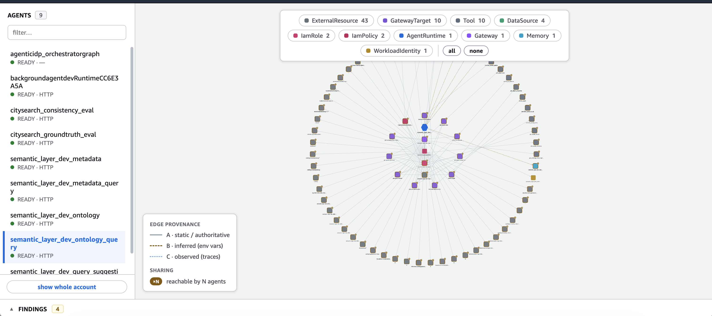
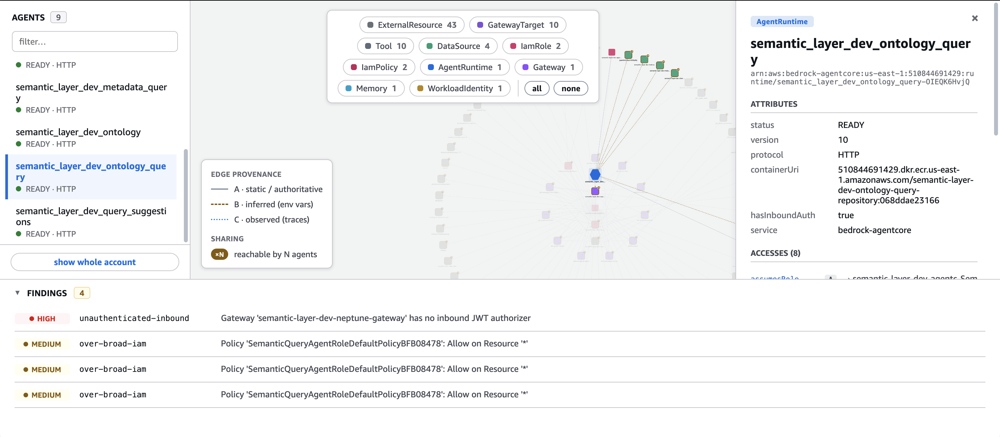
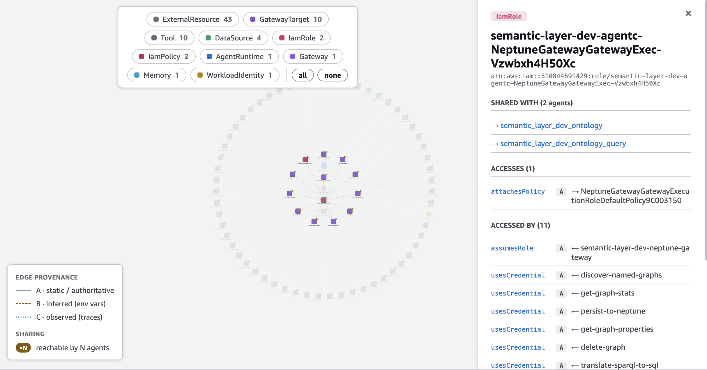

# AgentCore Access Graph

A read-only "single pane of glass" that maps the full access chain of any
Amazon Bedrock AgentCore agent:

```
agent → tools → gateway → permissions → policies → external resources → data sources
```

See [`docs/SPEC.md`](docs/SPEC.md) for the full design, and
[`DEVELOP.md`](DEVELOP.md) for exact setup, build, test, run, and deploy steps.

> **No LLM, no token cost.** This tool is 100% deterministic Python — the
> findings engine, reachability, and env-var inference are plain rule logic, not
> model calls. It makes **no** call to any LLM (no Anthropic/OpenAI, no Bedrock
> `invoke_model`/`converse` — there is no `bedrock-runtime` client anywhere). It
> talks only to read-only AWS control-plane/IAM/STS/SSM APIs (all free of request
> charges); CloudWatch Logs Insights is used **only** under the opt-in
> `--observe` flag. Running it against any account or machine costs zero tokens.

## What it does

- Enumerates AgentCore runtimes, gateways + targets + tools, memories,
  workload identities, credential providers, policy engines, and registries
  from the `bedrock-agentcore-control` API (read-only).
- Resolves each execution role's IAM policies into the concrete resource ARNs
  it grants (`iam:GetRole`, `ListAttached/ListRolePolicies`, `GetPolicyVersion`).
- Recovers the associations the control plane omits (agent→gateway,
  agent→memory) by parsing runtime `environmentVariables`, dereferencing SSM
  parameter refs, and matching gateways by URL/id — **Tier B**.
- Overlays what agents *actually* invoked from CloudWatch `aws/spans` traces
  (opt-in `--observe`) — **Tier C**.
- Emits a single typed graph document (nodes + edges + findings), where every
  edge carries a **provenance tier**:
  - **A** — static/authoritative (control-plane config or IAM)
  - **B** — inferred from env vars / SSM
  - **C** — observed from traces (opt-in)
- Stamps each resource with the set of agents that can reach it
  (`sharedByAgents`) — the multi-tenancy / blast-radius signal.
- Flags governance issues: over-broad IAM, unauthenticated inbound,
  dangling credentials, non-enforcing Cedar policies, cross-boundary data
  egress, and (with `--observe`) over-provisioning gaps + untraced agents.

## Usage

First install the CLI (see [`DEVELOP.md`](DEVELOP.md) for full setup):

```bash
pip install -e .
```

```bash
# whole account/region -> stdout
agentcore-graph --region us-east-1 -o graph.json

# just one agent's access chain (the core web-app query)
agentcore-graph --region us-east-1 \
    --agent arn:aws:bedrock-agentcore:us-east-1:ACCT:runtime/foo-XXXX -o foo.json

# counts + findings only (no JSON payload)
agentcore-graph --region us-east-1 --summary

# drop raw source payloads to shrink the document
agentcore-graph --region us-east-1 --no-raw -o graph.json

# overlay Tier-C observed edges from traces (opt-in; scans CloudWatch Logs)
agentcore-graph --region us-east-1 --observe -o graph.json

# print the least-privilege reader IAM policy this tool needs, then exit
agentcore-graph --region us-east-1 --print-policy
```

Uses your ambient AWS credentials (same-account, read-only). The tool never
performs a write action; a missing permission degrades one collector and is
recorded under `collectionErrors` rather than failing the build.

## Web app (M3)

An interactive node-link view of the same graph, styled to match the **AWS
Console (Cloudscape)** look: inventory side-nav (pick an agent) → its access
chain rendered with tier-styled edges (solid A, dashed B, dotted C) →
**category filter chips** to show/hide node types (Gateway, Memory, IAM,
ExternalResource, …) → click any node for its raw payload + provenance →
findings docked along the bottom, click-to-focus.

```bash
pip install -e '.[web]'
uvicorn agentcore_graph.api:app --port 8899
# open http://localhost:8899/
```

The frontend is a no-build single page (Cytoscape.js vendored into the package)
served by the API — no npm step, no CDN at runtime. Endpoints:
`GET /api/inventory`, `GET /api/graph?agent=<arn>` (add `?refresh=1` to rebuild
from AWS, `?raw=true` to include source payloads).

### Screenshots

> The agents in these screenshots are **public AWS sample agents** — deployed
> from public-facing `aws-samples` repositories into a scratch account purely to
> have something to graph. Nothing here is customer or proprietary data, and the
> findings shown are properties of those sample deployments, not of this tool.

**One agent's access chain.** Pick an agent in the side-nav and the view traces
everything it can reach — tools, gateway targets, IAM roles/policies, and the
external resources at the rim — with the category chips counting each node type
and the legend keying the provenance tier of every edge.



**Node detail + findings.** Clicking a node opens its raw control-plane payload;
the findings drawer docks along the bottom, severity-ranked and click-to-focus.



**Blast radius.** Any shared resource names the agents that can reach it —
here one gateway execution role is reachable by 2 agents and accessed by 11
tools, which is the multi-tenancy signal the graph exists to surface.



## Required IAM permissions

Attach [`docs/reader-policy.json`](docs/reader-policy.json) to the principal
running the tool. All read-only.

## Deployment & auth

Today the tool is **single-tenant**: there's no login and no account parameter —
it graphs whatever account the process's ambient AWS credentials resolve to
(`~/.aws`, `AWS_PROFILE`, env vars, or an attached instance/task role). Three
deployment models (local per-user, shared single-account, multi-account via
assume-role) and the code seams for each are written up in
[`docs/SPEC.md` §9a](docs/SPEC.md). Note: the web API has **no authentication
yet**, so any shared deployment needs an auth layer added first.

## Layout

```
src/agentcore_graph/
  model.py       nodes, edges, findings, tiers, Graph
  aws.py         boto3 client factory, pagination, ARN parsing
  collectors.py  one read-only collector per concern
  resolver.py    runs collectors, resolves Tier-B aliases, computes findings
  cli.py         command-line entrypoint
  api.py         FastAPI backend (/api/inventory, /api/graph)
  web/           no-build single-page frontend (Cytoscape.js, vendored)
scripts/m0_probe.py   the M0 live-probe used to lock field semantics
tests/test_graph.py   offline unit tests (no AWS)
docs/SPEC.md          full design spec
assets/images/        README screenshots
```

## Tests

```bash
python3 tests/test_graph.py        # offline, no AWS
```

## Status

- [x] **M0** — live probe & schema lock
- [x] **M1** — static backbone collectors + resolver + CLI
- [x] **M2** — Tier-B inference (env vars, SSM deref, robust gateway-URL join)
- [x] **M3** — web app (FastAPI + node-link graph UI)
- [x] **M4** — findings engine (incl. cross-boundary egress) + IAM policy export
- [x] **M5** — observability (Tier C) overlay (opt-in `--observe`)
- [ ] **v2** — snapshots & diff; org / multi-account crawl
